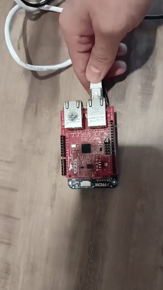

# KickCAT

<p align="center">
  <strong>A lightweight, efficient EtherCAT master/slave stack for embedded systems</strong>
</p>

<p align="center">
  <em>Kick-start your slaves! ⚡</em>
</p>

---

## Overview

KickCAT is a thin EtherCAT stack designed to be embedded in complex software with efficiency in mind. It provides both **master** and **slave** implementations, supporting multiple operating systems and hardware platforms.

**Key Features:**
- Works with Linux (including RT-PREEMPT), Windows, and PikeOS
- Full state machine support (INIT → PRE-OP → SAFE-OP → OP)
- CoE (CANopen over EtherCAT) support with SDO read/write
- Interface redundancy
- Bus diagnostics and error handling
- Python bindings available
- Built-in simulator for testing without hardware

---

## Quick Start

### Prerequisites

- **Linux**: gcc, cmake, conan (for dependencies)
- **Python bindings**: uv or pip
- **Hardware**: Network interface with raw socket access capabilities

### Build and Install

#### Linux (Recommended)

```bash
# 1. Setup build environment
./setup_build.sh build

# 2. Configure and build
cd build
cmake .. -DCMAKE_BUILD_TYPE=Release
make

# 3. Grant network capabilities (required for raw socket access)
sudo setcap 'cap_net_raw,cap_net_admin=+ep' ./tools/your_binary
```

#### Python Bindings

```bash
# Install with uv (recommended)
uv pip install .

# Or for development (faster rebuilds)
uv pip install --no-build-isolation -Cbuild-dir=/tmp/build -v .
```

<details>
<summary><b>Manual Build Setup</b></summary>

```bash
# 1. Create build directory
mkdir -p build

# 2. Install dependencies with conan
python3 -m venv kickcat_venv
source kickcat_venv/bin/activate
pip install conan

conan install conan/conanfile_linux.txt -of=build/ \
  -pr:h conan/your_profile_host.txt \
  -pr:b conan/your_profile_target.txt \
  --build=missing -s build_type=Release

# 3. Configure and build
cd build
cmake .. -DCMAKE_BUILD_TYPE=Release
make
```

</details>

<details>
<summary><b>Windows Build</b></summary>

**Note:** Windows is NOT suitable for real-time use but useful for tools and testing.

Requirements:
- Conan for Windows (tested with 2.9.1)
- gcc for Windows (tested with w64devkit 2.0.0)
- npcap (driver 1.80 + SDK 1.70)

Follow the manual setup instructions above, using appropriate Windows paths.

</details>

<details>
<summary><b>PikeOS Build</b></summary>

Tested on PikeOS 5.1 for native personality (p4ext).

Provide a CMake cross-toolchain file that defines the `PIKEOS` variable. Example process/thread configurations are in `examples/PikeOS/p4ext_config.c`.

</details>

---

## Getting Started: Complete Walkthrough

This section provides a complete end-to-end example using the **Freedom K64F board** with LAN9252 EtherCAT slave controller.

### Hardware Requirements

- **NXP Freedom K64F** development board
- **LAN9252** EtherCAT slave controller (SPI connection)
- **Ethernet cable** (connects slave to your PC)
- **USB cable** (for programming the board)
- **Linux PC** with EtherCAT master

### Step 1: Build the Slave Firmware

```bash
# Build firmware for Freedom K64F
./scripts/build_slave_bin.sh freedom-k64f ~/nuttxspace/nuttx

# Output will be in: build_freedom-k64f/easycat_frdm_k64f.bin
```

### Step 2: Flash the Firmware

```bash
# Deploy to the board (connects via USB)
./examples/slave/nuttx/lan9252/freedom-k64f/board/deploy.sh \
    build_freedom-k64f/easycat_frdm_k64f.bin
```

### Step 3: Program the EEPROM

The EtherCAT slave requires EEPROM configuration with device information:

```bash
# Connect slave to your PC via Ethernet
# Write EEPROM (interface ? will be auto-detected)
sudo ./tools/eeprom 0 write \
    examples/slave/nuttx/lan9252/freedom-k64f/eeprom.bin \?
```

**Note:** The `\?` tells the tool to auto-detect the interface where the slave is connected.

### Step 4: Run the Master

Now you can control your slave using either C++ or Python:

**Option A - C++ Master:**
```bash
# Run master example (replace enp8s0 with your interface)
sudo ./build/examples/master/freedom-k64f/freedom_k64f_example enp8s0
```

**Option B - Python Master:**
```bash
# Install KickCAT Python bindings
pip install kickcat

# Grant raw access to Python interpreter
./py_bindings/enable_raw_access.sh

# Run Python example
python py_bindings/examples/freedom-k64f.py -i enp8s0
```

### Expected Output



The master will:
1. Discover the slave on the network
2. Transition through states: INIT → PRE-OP → SAFE-OP → OP
3. Begin exchanging process data (PDOs)
4. Display diagnostic information

<details>
<summary><b>Troubleshooting</b></summary>

**Slave not detected:**
- Check Ethernet cable connection
- Verify EEPROM was written successfully
- Check that slave firmware is running (LED indicators)

**Permission denied:**
- Ensure you're running master with `sudo` or proper capabilities
- For Python: run `./py_bindings/enable_raw_access.sh`

**Interface not found:**
- List available interfaces: `ip link show`
- Use the correct interface name (e.g., `eth0`, `enp8s0`, `eno1`)

</details>

---

## Getting Started with Examples

KickCAT includes working master and slave examples that work together out of the box.

### Master Examples

Located in `examples/master/`:

- **easycat**: Basic example for EasyCAT shield
- **elmo**: Motor control example (Elmo drives)
- **ingenia**: Motor control example (Ingenia drives)
- **freedom-k64f**: Example for Kinetis Freedom board
- **gateway**: EtherCAT mailbox gateway implementation
- **load_esi**: ESI file loading utility

#### Running a Master Example

**C++ Examples:**
```bash
cd build
./examples/master/easycat/easycat_example eth0
```

**Python Examples:**

KickCAT is available on PyPI for easy installation:

```bash
# Install from PyPI
pip install kickcat

# Run Python examples
python py_bindings/examples/freedom-k64f.py --interface eth0

# With redundancy
python py_bindings/examples/easycat.py -i eth0 -r eth1
```

<details>
<summary><b>Python Examples Help</b></summary>

```bash
$ python py_bindings/examples/freedom-k64f.py --help
usage: freedom-k64f.py [-h] -i INTERFACE [-r REDUNDANCY]

EtherCAT master for Freedom K64F using EasyCAT

options:
  -h, --help            show this help message and exit
  -i INTERFACE, --interface INTERFACE
                        Primary network interface (e.g., eth0)
  -r REDUNDANCY, --redundancy REDUNDANCY
                        Redundancy network interface (e.g., eth1)
```

**Important:** Python interpreter needs raw socket capabilities:
```bash
# Use the helper script to grant permissions
./py_bindings/enable_raw_access.sh
```

</details>

Replace `eth0` with your network interface name.

### Slave Examples

Located in `examples/slave/nuttx/`:

**Supported Boards:**
- **XMC4800** (Infineon XMC4800 Relax Kit)
- **Arduino Due** (with EasyCAT shield + LAN9252)
- **Freedom K64F** (NXP Kinetis with LAN9252)

#### Building Slave Examples

All slave examples use NuttX RTOS. Use the automated build script:

```bash
./scripts/build_slave_bin.sh <board-name> <nuttx-src-path> [build-name]
```

**Example:**
```bash
# Build for XMC4800
./scripts/build_slave_bin.sh xmc4800-relax ~/nuttxspace/nuttx

# Build for Arduino Due
./scripts/build_slave_bin.sh arduino-due ~/nuttxspace/nuttx

# Build for Freedom K64F
./scripts/build_slave_bin.sh freedom-k64f ~/nuttxspace/nuttx
```

<details>
<summary><b>NuttX Setup Instructions</b></summary>

#### Prerequisites

1. Install NuttX dependencies: https://nuttx.apache.org/docs/latest/quickstart/install.html
2. Clone NuttX repositories (recommended version: nuttx-12.6.0)
3. Download ARM GCC toolchain (>= 12.0): https://developer.arm.com/downloads/-/arm-gnu-toolchain-downloads

#### Board-Specific Setup

**Arduino Due:**
- Requires `bossac-1.6.1-arduino` for flashing (available from Arduino IDE installation)
- Connect USB to the port closest to power jack
- If flashing fails with "No device found on ttyACM0":
  - Press ERASE button for a few seconds, release
  - Press RESET button
  - Try flashing again

**Freedom K64F:**
- Standard OpenOCD flashing supported

**XMC4800:**
- Use provided flashing scripts in board directory

</details>

<details>
<summary><b>Testing Master-Slave Communication</b></summary>

1. **Start the simulator or flash a slave:**
   ```bash
   # Option A: Use simulator
   ./build/simulation/simulator eth1 eeprom.bin
   
   # Option B: Flash real hardware (e.g., Arduino Due)
   ./scripts/build_slave_bin.sh arduino-due ~/nuttxspace/nuttx
   # Flash the resulting binary to your board
   ```

2. **Run a master example:**
   ```bash
   # Use the interface connected to your slave
   ./build/examples/master/easycat/easycat_example eth0
   ```

3. **Expected behavior:**
   - Master transitions slave through states: INIT → PRE-OP → SAFE-OP → OP
   - PDO data exchange begins in OP state
   - Check console output for diagnostics

</details>

---

## Simulator

Test your EtherCAT applications without physical hardware using the built-in simulator.

### Setup

```bash
# Create virtual ethernet pair (Linux)
./create_virtual_ethernet.sh

# Or use real network interfaces between two machines
```

### Running the Simulator

```bash
# Start simulator (must be started before master)
./build/simulation/simulator <interface> <eeprom_file>

# Example
./build/simulation/simulator eth1 examples/slave/nuttx/lan9252/arduino-due/eeprom.bin
```

**Current Capabilities:**
- Load EEPROM configurations
- Emulate basic sync manager behavior
- Emulate basic FMMU (Fieldbus Memory Management Unit) behavior

**Limitations:**
- No interrupt emulation
- No redundancy support yet
- Basic functionality only

---

## Tools

KickCAT includes several utility tools in the `tools/` directory:

- **Bus diagnostics**: Error counters, slave discovery
- **EEPROM tools**: Read/write/dump EEPROM from ESC
- **SDO explorer**: Browse CANopen object dictionaries
- **ETG.8200 Gateway**: Mailbox gateway implementation
- **OD Generator**: Generate Object Dictionary code from ESI files

Build tools with the main project:
```bash
cd build
make
ls tools/  # Your built tools will be here
```

### EEPROM Tool Usage

Read, write, or dump EEPROM content from your EtherCAT Slave Controller:

```bash
# Write EEPROM to slave at position 0
sudo ./tools/eeprom 0 write path/to/eeprom.bin <interface>

# Auto-detect interface
sudo ./tools/eeprom 0 write path/to/eeprom.bin \?

# Read EEPROM from slave
sudo ./tools/eeprom 0 read output.bin <interface>

# Dump EEPROM contents (human-readable)
sudo ./tools/eeprom 0 dump <interface>
```

### Object Dictionary Generator

If your application uses CoE mailbox with SDO, you can generate Object Dictionary code from ESI files.

#### Generate OD from ESI File

```bash
# Generate od_populator.cc from your ESI file
./tools/od_generator your_device.esi

# This creates: od_populator.cc
```

#### Using Generated OD Code

Include the generated file in your slave application:

```cpp
#include "od_populator.h"

int main() {
    // Initialize your slave
    // ...
    
    // Populate Object Dictionary
    auto dictionary = CoE::createOD();
    
    // Continue with slave operation
    // ...
}
```

#### Custom OD Population

You can also manually create `od_populator.cc` by implementing the `CoE::createOD()` function.

**Examples:** See `examples/slave/nuttx/xmc4800/od_populator.cc` and `examples/slave/nuttx/lan9252/freedom-k64f/od_populator.cc` for reference implementations.

---

## Architecture

### Master Stack Status

✅ **Implemented:**
- Full EtherCAT state machine (INIT, PRE-OP, SAFE-OP, OP)
- Process data (PI) read/write
- CoE: SDO read/write (blocking and async)
- CoE: Emergency messages
- CoE: SDO Information service
- Bus diagnostics with error counters
- Interface redundancy
- Hook system for non-compliant slaves
- Consecutive writes (up to 255 datagrams in flight)
- EtherCAT mailbox gateway (ETG.8200)

⏳ **In Progress:**
- CoE: Segmented transfer (partial)
- CoE: Diagnosis message (0x10F3)
- Distributed clock support

📋 **Planned:**
- FoE, EoE, AoE, SoE profiles
- Auto-discovery of broken wires
- AF_XDP Linux socket for improved performance
- Addressing groups (multi-PDO)

### Slave Stack Status

✅ **Implemented:**
- State machine: INIT → PRE-OP → SAFE-OP → OP
- Process data read/write
- ESC support: LAN9252 (SPI), XMC4800
- CoE: Object dictionary
- CoE: SDO support
- EEPROM flash/dump tools
- CTT (Conformance Test Tool) validated (XMC4800)

📋 **Planned:**
- Extended mailbox protocols (SDO Information, FoE, EoE)
- Multi-PDO support (>2 sync managers)
- Distributed clock
- Enhanced error reporting via AL_STATUS

---

## Performance Optimization (Linux)

For real-time performance on Linux:

1. **Use RT-PREEMPT kernel**
   ```bash
   # Check if RT patches are applied
   uname -a | grep PREEMPT
   ```

2. **Set real-time scheduler**
   ```bash
   sudo chrt -f 80 ./your_ethercat_app
   ```

3. **Disable NIC interrupt coalescing**
   ```bash
   sudo ethtool -C eth0 rx-usecs 0 tx-usecs 0
   ```

4. **Disable RT throttling**
   ```bash
   echo -1 | sudo tee /proc/sys/kernel/sched_rt_runtime_us
   ```

5. **Isolate CPU cores**
   ```bash
   # Add to kernel boot parameters
   isolcpus=2,3 nohz_full=2,3 rcu_nocbs=2,3
   ```

6. **Adjust network IRQ priority**
   ```bash
   # Find IRQ number
   cat /proc/interrupts | grep eth0
   # Set priority
   sudo chrt -f 90 -p <IRQ_thread_PID>
   ```

---

### EtherCAT Specifications
- [ETG Official Documentation](https://www.ethercat.org/en/downloads.html)
- [Beckhoff EtherCAT Documentation](https://infosys.beckhoff.com/english.php?content=../content/1033/tc3_io_intro/1257993099.html)
- [ESC Datasheets](https://download.beckhoff.com/download/document/io/ethercat-development-products/)

### Learning Resources
- [EtherCAT Device Protocol Poster](https://www.ethercat.org/download/documents/EtherCAT_Device_Protocol_Poster.pdf)
- [EtherCAT Diagnostics Guide](https://www.automation.com/en-us/articles/2014-2/diagnostics-with-ethercat-part-4)
- [ESC Comparison](https://download.beckhoff.com/download/document/io/ethercat-development-products/an_esc_comparison_v2i7.pdf)

---

## Testing

### Unit Tests

```bash
# Enable unit tests in CMake
cd build
cmake .. -DBUILD_UNIT_TEST=ON
make

# Run tests
make test
```

### Code Coverage

Install gcovr and build with coverage:
```bash
# Install gcovr
uv pip install gcovr

# Build with coverage
cd build
cmake .. -DBUILD_UNIT_TEST=ON -DCMAKE_BUILD_TYPE=Debug
make
make coverage
```

---

## Release Process

KickCAT follows [Semantic Versioning](https://semver.org/).

### Release Requirements

Before a version leaves release candidate status:
- ✅ 5+ continuous days of testing without bugs (no realtime loss, crashes, or memory leaks)
- ✅ 80% line coverage and 50% branch coverage for master/slave stack
- ✅ Update [Conan Center](https://github.com/conan-io/conan-center-index/tree/master/recipes/kickcat)
- ✅ Create GitHub release with changelog

---

## Contributing

Contributions are welcome! Please see [CONTRIBUTING.md](CONTRIBUTING.md) for guidelines.

### Development Setup

```bash
# Clone repository
git clone https://github.com/leducp/KickCAT.git
cd KickCAT

# Setup build environment
./setup_build.sh build

# Build with tests
cd build
cmake .. -DBUILD_UNIT_TEST=ON -DCMAKE_BUILD_TYPE=Debug
make
```

---

## Platform Support

| Platform | Master | Slave | Status |
|----------|--------|-------|--------|
| Linux (x86_64) | ✅ | ❌ | Production |
| Linux RT-PREEMPT | ✅ | ❌ | Recommended for real-time |
| Windows | ⚠️ | ❌ | Testing/tools only |
| PikeOS 5.1 | ✅ | ❌ | Production |
| NuttX RTOS | ❌ | ✅ | Production |
| Arduino Due | ❌ | ✅ | via NuttX |
| XMC4800 | ❌ | ✅ | via NuttX, CTT validated |
| Freedom K64F | ❌ | ✅ | via NuttX |

---

## Known Limitations

### Master Stack
- **Little-endian only**: Current implementation supports little-endian hosts only
- **Windows**: Not suitable for real-time applications
- **Distributed Clock**: Not yet implemented

### Slave Stack
- **PDO limitation**: Currently supports up to 2 sync managers (working on multi-PDO)
- **Distributed Clock**: Not yet implemented
- **Mailbox protocols**: Limited to CoE SDO (FoE, EoE planned)

---

## License

[License information - add your license here]

---

## Support & Community

- **Issues**: [GitHub Issues](https://github.com/leducp/KickCAT/issues)
- **Discussions**: [GitHub Discussions](https://github.com/leducp/KickCAT/discussions)
- **Conan Package**: [conan-center-index](https://github.com/conan-io/conan-center-index/tree/master/recipes/kickcat)

---

## Project Status

🟢 **Active Development** - KickCAT is actively maintained and used in production systems.

**Current Version**: Check [Releases](https://github.com/leducp/KickCAT/releases) for the latest stable version.

**Release Cycle**: Following semantic versioning with thorough testing before each major release.
