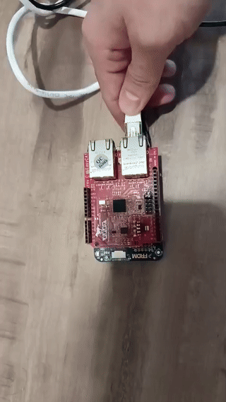
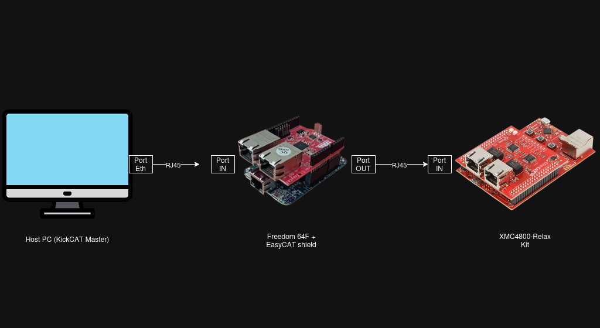
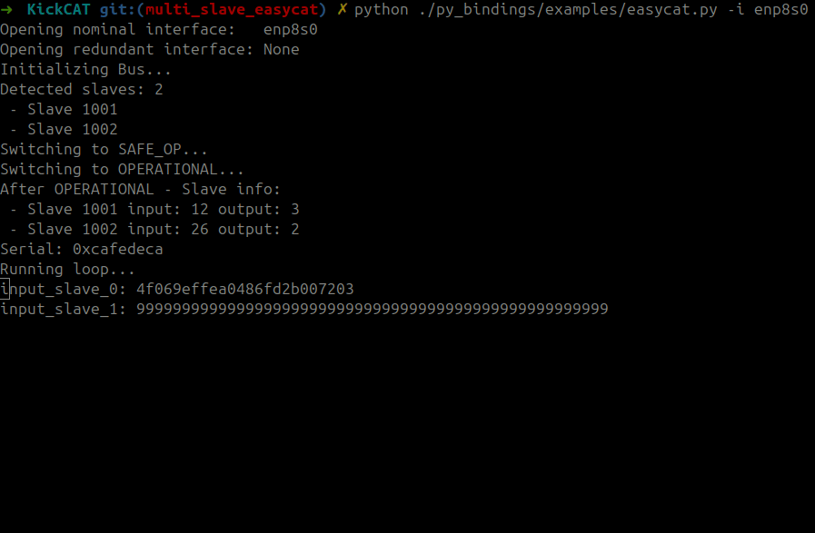

# Hardware guide: slaves, firmware, and deployment

This guide covers running KickCAT against real hardware: building and flashing
NuttX slave firmware, provisioning EEPROM, and running a master against the
slaves. For a no-hardware path, use the simulator instead -- see
[SIMULATION.md](SIMULATION.md).

Build the host-side binaries first; see [BUILDING.md](BUILDING.md).

---

## Complete walkthrough: Freedom K64F + LAN9252

End-to-end example using the **NXP Freedom K64F** board with a **LAN9252**
EtherCAT slave controller.

### Hardware requirements

- NXP Freedom K64F development board
- LAN9252 EtherCAT slave controller (SPI connection)
- Ethernet cable (slave to PC)
- USB cable (for programming the board)
- Linux PC running the EtherCAT master

See [NuttX prerequisites](#nuttx-prerequisites) before starting.

### Step 1: Build the slave firmware

```bash
./scripts/build_slave_bin.sh freedom-k64f ~/nuttxspace/nuttx
# Output: build_freedom-k64f/easycat_frdm_k64f.bin
```

### Step 2: Flash the firmware

```bash
./examples/slave/lan9252/freedom-k64f/nuttx/deploy.sh \
    build_freedom-k64f/easycat_frdm_k64f.bin
```

### Step 3: Program the EEPROM

The slave requires EEPROM configuration with device information:

```bash
# Connect the slave to your PC via Ethernet, then write the EEPROM.
# "?" auto-detects the interface where the slave is connected.
sudo ./tools/eeprom -s 0 -c write -f examples/slave/lan9252/freedom-k64f/nuttx/eeprom.bin -i "?"
```

### Step 4: Run the master

C++ master:

```bash
sudo ./build/examples/master/freedom-k64f/freedom_k64f_static_map_example -i "?"
```

Python master:

```bash
pip install kickcat
./py_bindings/enable_raw_access.sh
python py_bindings/examples/freedom-k64f.py -i enp8s0
```

### Expected output



The master will:

1. Discover the slave on the network.
2. Transition through INIT -> PRE-OP -> SAFE-OP -> OP.
3. Begin exchanging process data (PDOs).
4. Display diagnostic information.

### Troubleshooting

**Slave not detected**

- Check the Ethernet cable connection.
- Verify the EEPROM was written successfully.
- Check that the slave firmware is running (LED indicators).

**Permission denied**

- Run the master with `sudo` or grant capabilities (see [BUILDING.md](BUILDING.md)).
- For Python: run `./py_bindings/enable_raw_access.sh`.

**Interface not found**

- List interfaces: `ip link show`.
- Use the correct interface name (e.g. `eth0`, `enp8s0`, `eno1`).

---

## Examples

### Master examples

Located in `examples/master/`:

- **easycat**: basic example for the EasyCAT shield
- **elmo**: motor control (Elmo drives)
- **ingenia**: motor control (Ingenia drives)
- **freedom-k64f**: example for the Kinetis Freedom board
- **gateway**: EtherCAT mailbox gateway (ETG.8200)
- **load_esi**: ESI file loading utility
- **wdc_foot**: CTT conformance example
- **simulated_bus**: in-process master + emulated slave (no hardware) -- see
  [SIMULATION.md](SIMULATION.md)

Run a C++ example:

```bash
cd build
./examples/master/easycat/easycat_example -i eth0
```

Run a Python example:

```bash
pip install kickcat
python py_bindings/examples/freedom-k64f.py --interface eth0

# With redundancy
python py_bindings/examples/easycat.py -i eth0 -r eth1
```

The Python interpreter needs raw-socket capabilities:

```bash
./py_bindings/enable_raw_access.sh
```

### Slave examples

Located in `examples/slave/<pdi-chip>/<board>/<os>/`. Supported boards:

- **XMC4800** (Infineon XMC4800 Relax Kit)
- **Arduino Due** (with EasyCAT shield + LAN9252)
- **Freedom K64F** (NXP Kinetis with LAN9252)

---

## NuttX prerequisites

1. Install NuttX dependencies:
   <https://nuttx.apache.org/docs/latest/quickstart/install.html>
2. Download the ARM GCC toolchain (>= 12.0):
   <https://developer.arm.com/downloads/-/arm-gnu-toolchain-downloads>

### Board-specific setup

**Arduino Due**

- Requires `bossac-1.6.1-arduino` for flashing (from the Arduino IDE install).
- Connect USB to the port closest to the power jack.
- If flashing fails with "No device found on ttyACM0": press ERASE for a few
  seconds, release, press RESET, and try again.

**Freedom K64F**

- Standard OpenOCD flashing supported.

**XMC4800**

- Use the provided flashing scripts in the board directory (J-Link).

---

## Building and deploying slave firmware

All slave examples use NuttX. Use the automated build script:

```bash
./scripts/build_slave_bin.sh <board-name> <nuttx-src-path> [build-name]
```

Examples:

```bash
# XMC4800
./scripts/build_slave_bin.sh xmc4800-relax ~/nuttxspace/nuttx
./examples/slave/xmc4800/xmc4800-relax/nuttx/deploy.sh build_xmc4800-relax/xmc4800_relax.bin

# Arduino Due
./scripts/build_slave_bin.sh arduino-due ~/nuttxspace/nuttx
./examples/slave/lan9252/arduino-due/nuttx/deploy.sh build_arduino-due/easycat_arduino_due.bin

# Freedom K64F
./scripts/build_slave_bin.sh freedom-k64f ~/nuttxspace/nuttx
./examples/slave/lan9252/freedom-k64f/nuttx/deploy.sh build_freedom-k64f/easycat_frdm_k64f.bin
```

CI artifacts can be extracted and deployed with:

```bash
./scripts/deploy_artifacts.sh <board-name> <artifact-zip-path>
```

---

## Multi-slave example

Run **multiple slaves** (Freedom and XMC4800) on the same bus and read their
data with the EasyCAT Python master.

### 1. Build and deploy the firmware

Follow the section above to build and flash both boards (Freedom and XMC4800).
Make sure both slaves are running before continuing.

### 2. Connect the hardware



Ensure that:

- All slaves are connected in the correct EtherCAT order.
- The master interface is connected to the first slave.

### 3. Run the Python EasyCAT master

```bash
python ./py_bindings/examples/easycat.py -i eth0
```

Replace `eth0` with the interface connected to your bus.

### Expected output

The master enumerates all slaves and continuously prints their input/output
data.


